#  Tugas Database Perpustakaan

## Identitas

* Nama: Muchammad Soufwan Fauzi
* NIM: 60324081
* Kelas: Pemweb II A

---

## 1. Statistik Buku

### 1. Total Buku
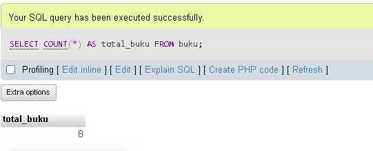

### 2. Total Nilai Inventaris
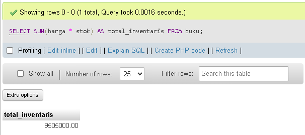

### 3. Rata-rata Harga Buku
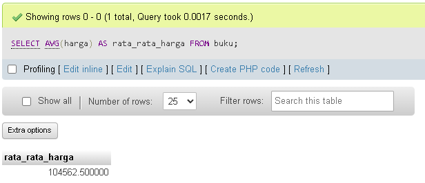

### 4. Buku Termahal
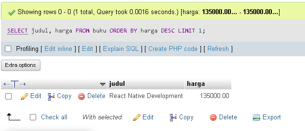

### 5. Stok Terbanyak
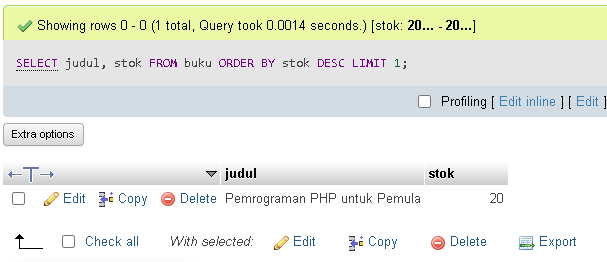

---

## 🔍 2. Filter & Pencarian

### 6. Programming < 100.000
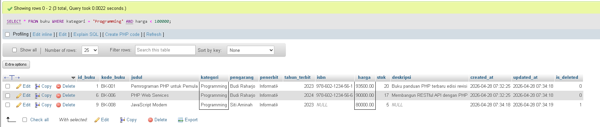

### 7. Judul PHP/MySQL
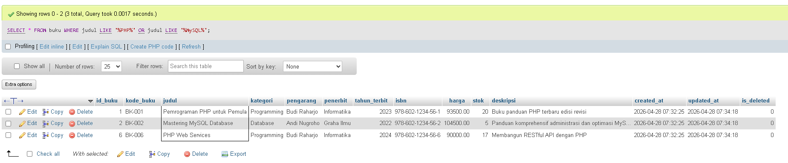

### 8. Tahun 2024
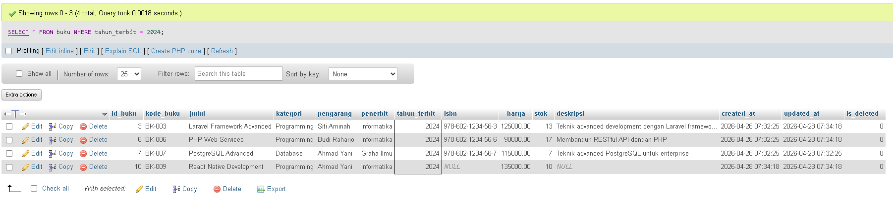

### 9. Stok 5–10
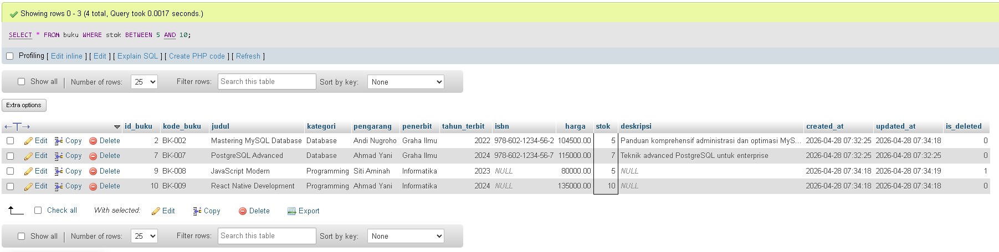

### 10. Pengarang Budi Raharjo
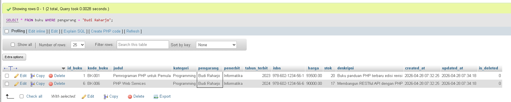

---

## 📈 3. Grouping & Agregasi

### 11. Jumlah Buku per Kategori
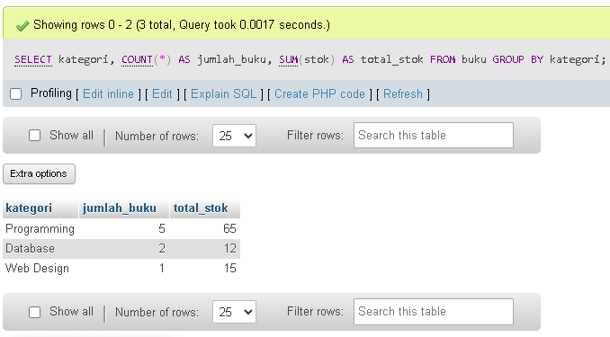

### 12. Rata-rata Harga per Kategori
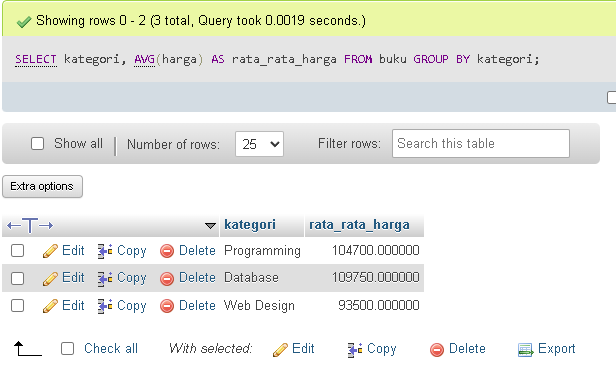

### 13. Nilai Inventaris Terbesar
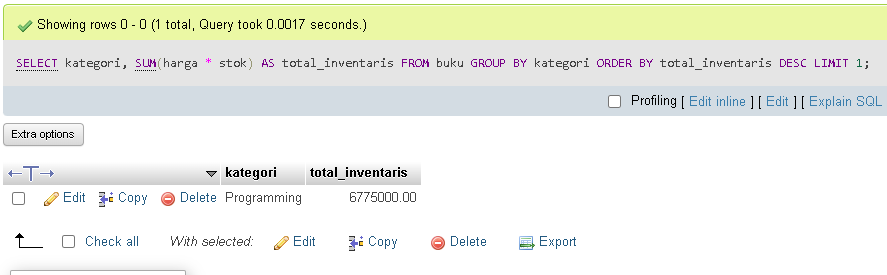

---

## 🔧 4. Update Data

### 14. Update Harga
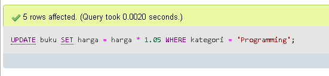

### 15. Update Stok
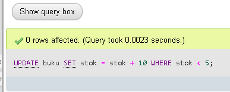

---

## 📑 5. Laporan Khusus

### 16. Restocking
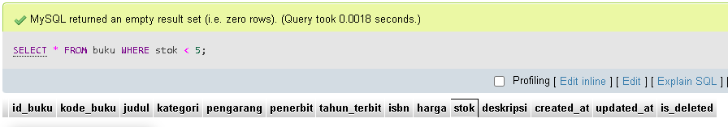

### 17. Top 5 Termahal
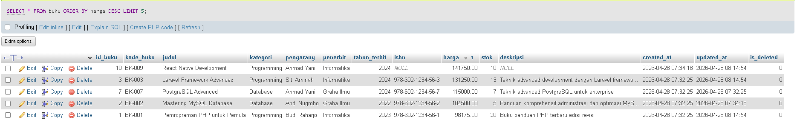
