# Tugas Database Perpustakaan Lengkap

## Identitas
- Nama: Muchammad Soufwan Fauzi
- NIM: 60324081
- Kelas: Pemweb A

---

## Deskripsi
Database ini merupakan sistem perpustakaan dengan fitur:
- Relasi kategori, penerbit, dan buku
- Penambahan tabel rak (bonus)
- Implementasi soft delete
- Stored procedure
- Query JOIN untuk menampilkan data relasional

---

#  1. Struktur Tabel
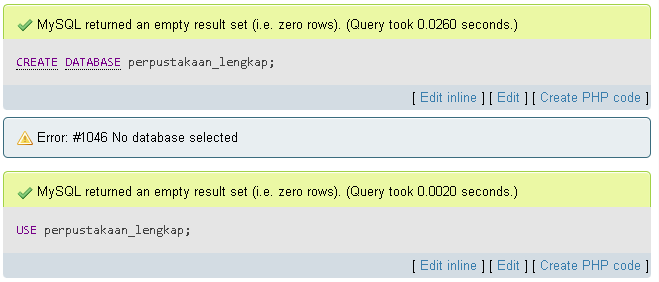

## 1.1 Tabel kategori_buku
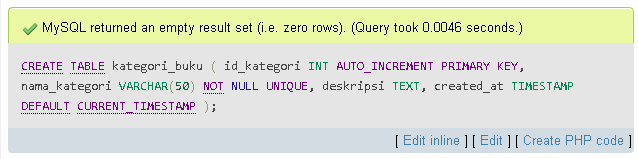

## 1.2 Tabel penerbit
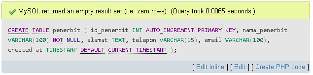

## 1.3 Tabel buku
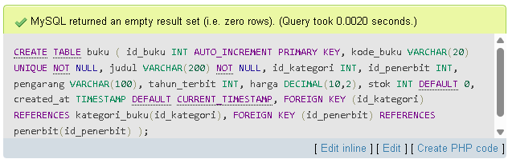

## 1.4 Tabel rak (Bonus)
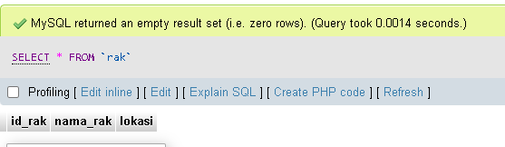

---

#  2. Data dalam Tabel

## 2.1 Data kategori_buku
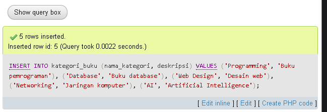
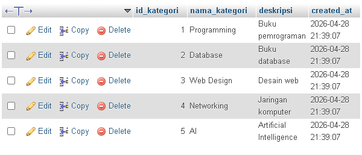

## 2.2 Data penerbit
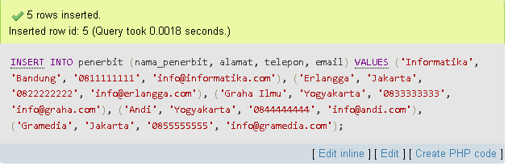
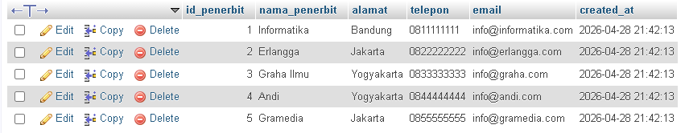

## 2.3 Data buku
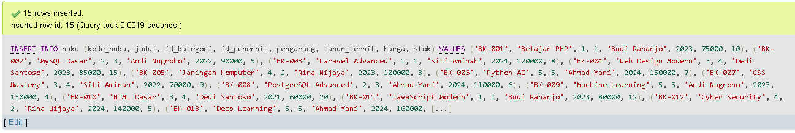
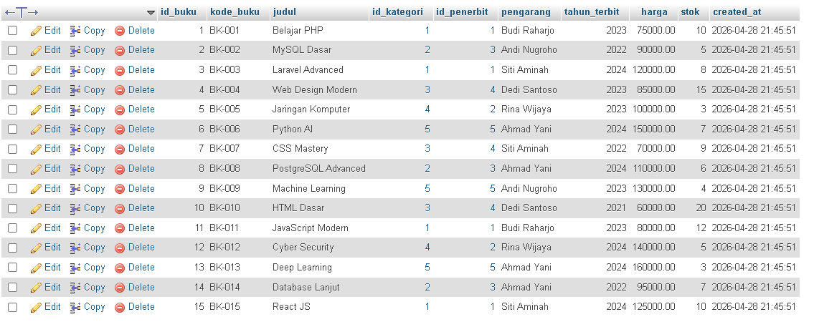
## 2.4 Data rak
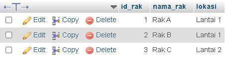

---

#  3. Hasil Query JOIN

## 3.1 Buku + Kategori + Penerbit
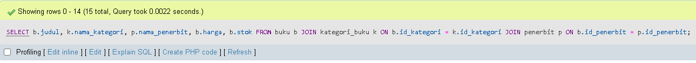
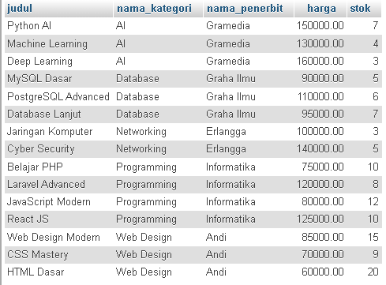

---

## 3.2 Jumlah Buku per Kategori
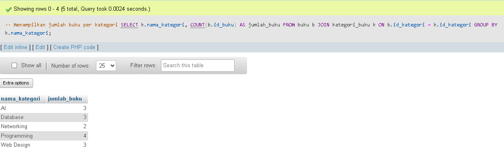

---

## 3.3 Jumlah Buku per Penerbit
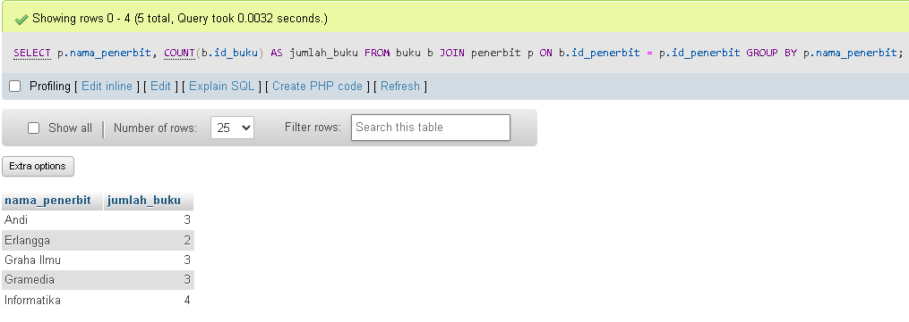

---

## 3.4 Detail Lengkap Buku
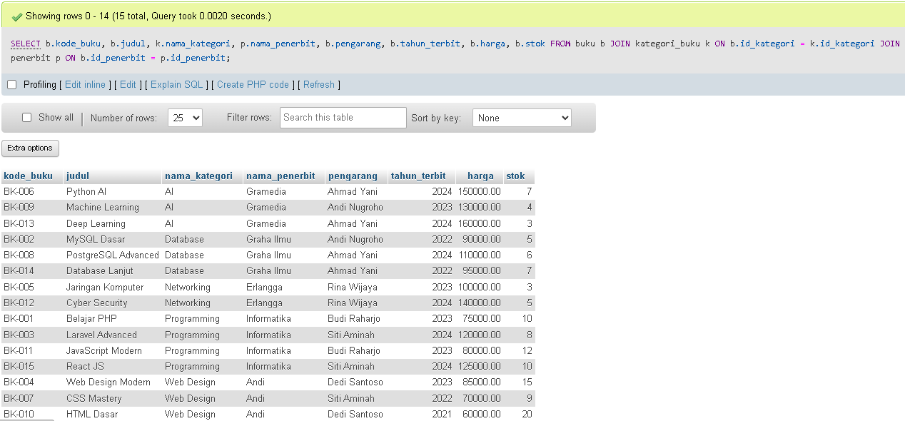

---

#  4. Bonus Feature

## 4.1 Relasi Buku dengan Rak
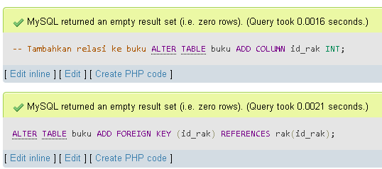

---

## 4.2 Soft Delete
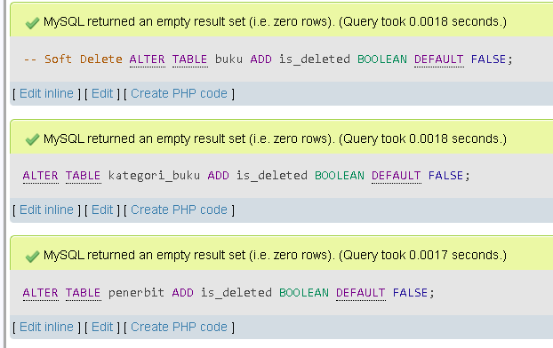

---

## 4.3 Stored Procedure
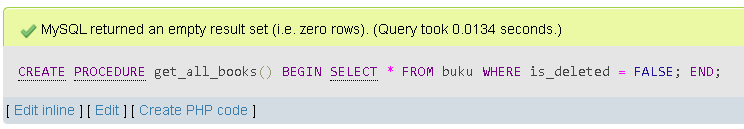
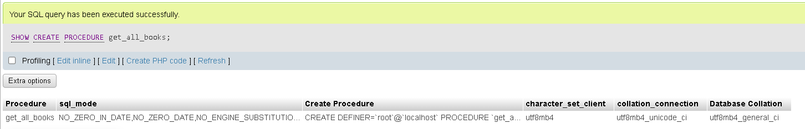

---

#  5. ERD (Entity Relationship Diagram)

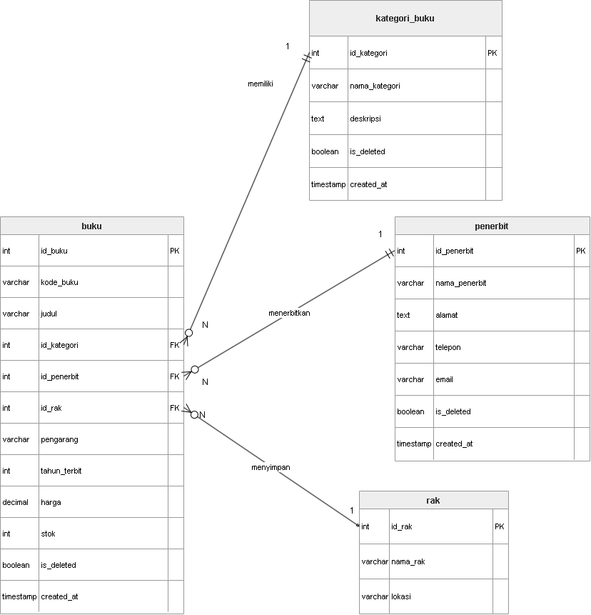

---

