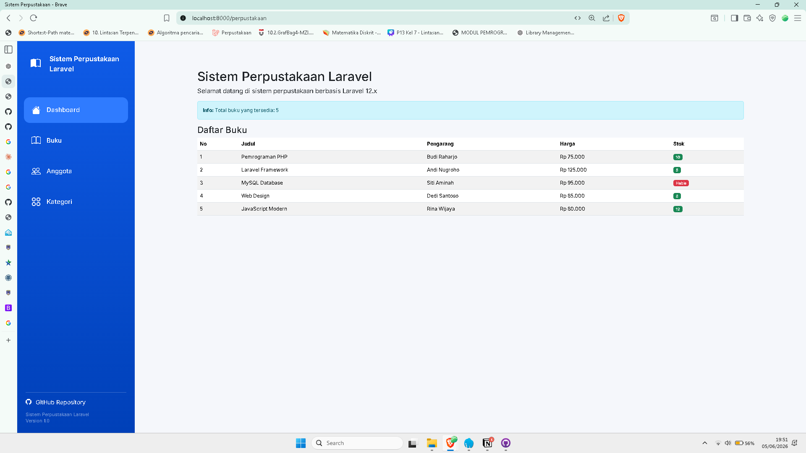
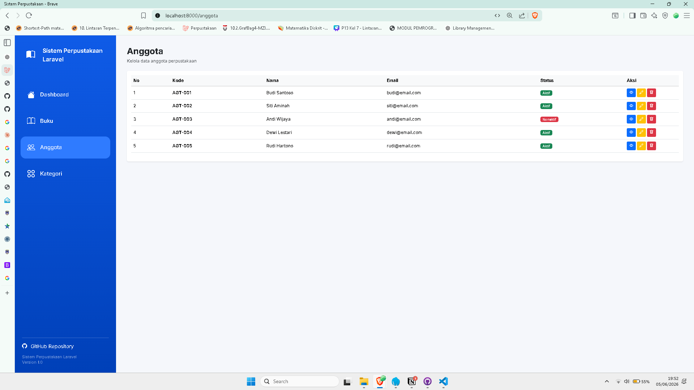
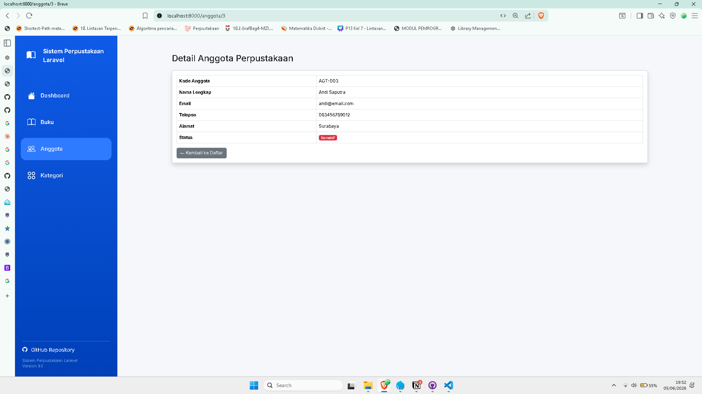
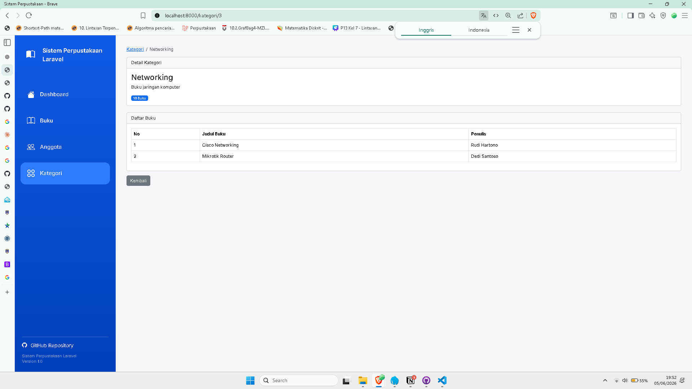
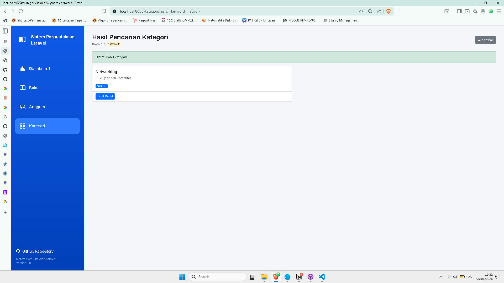

# 📚 Sistem Perpustakaan Laravel

Sistem Perpustakaan Laravel adalah aplikasi sederhana berbasis Laravel yang dibuat untuk mempelajari konsep **MVC (Model-View-Controller)**, Routing, Controller, Blade Template, dan Bootstrap 5.

Project ini merupakan implementasi tugas praktikum Laravel dengan fitur pengelolaan buku, anggota, dan kategori menggunakan data dummy.

---

# 🚀 Fitur Aplikasi

## Dashboard Perpustakaan

- Menampilkan informasi sistem perpustakaan
- Menampilkan daftar buku
- Menampilkan stok buku
- Menampilkan harga buku

## Manajemen Anggota

- Menampilkan daftar anggota
- Menampilkan detail anggota
- Status anggota aktif/nonaktif

## Manajemen Kategori

- Menampilkan daftar kategori buku
- Menampilkan detail kategori
- Menampilkan daftar buku berdasarkan kategori
- Pencarian kategori berdasarkan keyword

## About

- Informasi aplikasi
- Informasi pengembang

---

# 📸 Tampilan Aplikasi

## Dashboard



Halaman utama sistem perpustakaan.

---

## Daftar Anggota



Menampilkan seluruh data anggota perpustakaan.

---

## Detail Anggota



Menampilkan informasi lengkap anggota.

---

## Daftar Kategori


Menampilkan seluruh kategori buku yang tersedia.

---

## Detail Kategori



Menampilkan informasi kategori dan daftar buku berdasarkan kategori.

---

## Hasil Pencarian Kategori



Menampilkan hasil pencarian kategori berdasarkan keyword.

---

# 🛠️ Teknologi yang Digunakan

- PHP 8+
- Laravel 12
- Bootstrap 5
- Bootstrap Icons
- Blade Template Engine

---

# 📂 Struktur Folder

```text
app/
└── Http/
    └── Controllers/
        ├── PerpustakaanController.php
        └── KategoriController.php

resources/
└── views/
    ├── layouts/
    │   └── app.blade.php
    │
    ├── perpustakaan/
    │   ├── index.blade.php
    │   ├── show.blade.php
    │   └── about.blade.php
    │
    ├── anggota/
    │   ├── index.blade.php
    │   └── show.blade.php
    │
    └── kategori/
        ├── index.blade.php
        ├── show.blade.php
        └── search.blade.php

routes/
└── web.php
```

---

# 📖 Routing

## Perpustakaan

| Route         | Deskripsi      |
| ------------- | -------------- |
| /perpustakaan | Dashboard      |
| /buku/{id}    | Detail Buku    |
| /about        | Tentang Sistem |

## Anggota

| Route         | Deskripsi      |
| ------------- | -------------- |
| /anggota      | Daftar Anggota |
| /anggota/{id} | Detail Anggota |

## Kategori

| Route            | Deskripsi          |
| ---------------- | ------------------ |
| /kategori        | Daftar Kategori    |
| /kategori/{id}   | Detail Kategori    |
| /kategori/search | Pencarian Kategori |

---

# ⚙️ Cara Menjalankan Project

Clone repository:

```bash
git clone https://github.com/username/project-perpustakaan.git
```

Masuk ke folder project:

```bash
cd project-perpustakaan
```

Install dependency:

```bash
composer install
```

Copy file environment:

```bash
cp .env.example .env
```

Generate key Laravel:

```bash
php artisan key:generate
```

Jalankan aplikasi:

```bash
php artisan serve
```

Buka browser:

```text
http://127.0.0.1:8000
```

---

# 🎯 Konsep yang Dipelajari

Project ini dibuat untuk mempelajari:

- Routing Laravel
- Controller Laravel
- Blade Template
- Layout Master
- Passing Data ke View
- MVC Architecture
- Bootstrap Integration
- Search Data dengan PHP Array

---

# 👨‍💻 Developer

Nama: [Nama Mahasiswa]

Program Studi: Informatika

Framework: Laravel 12

---

# 📄 License

Project ini dibuat untuk kebutuhan pembelajaran dan tugas akademik.
