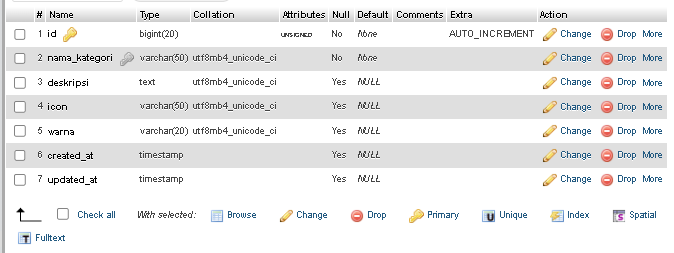
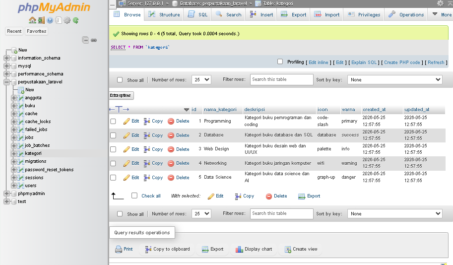
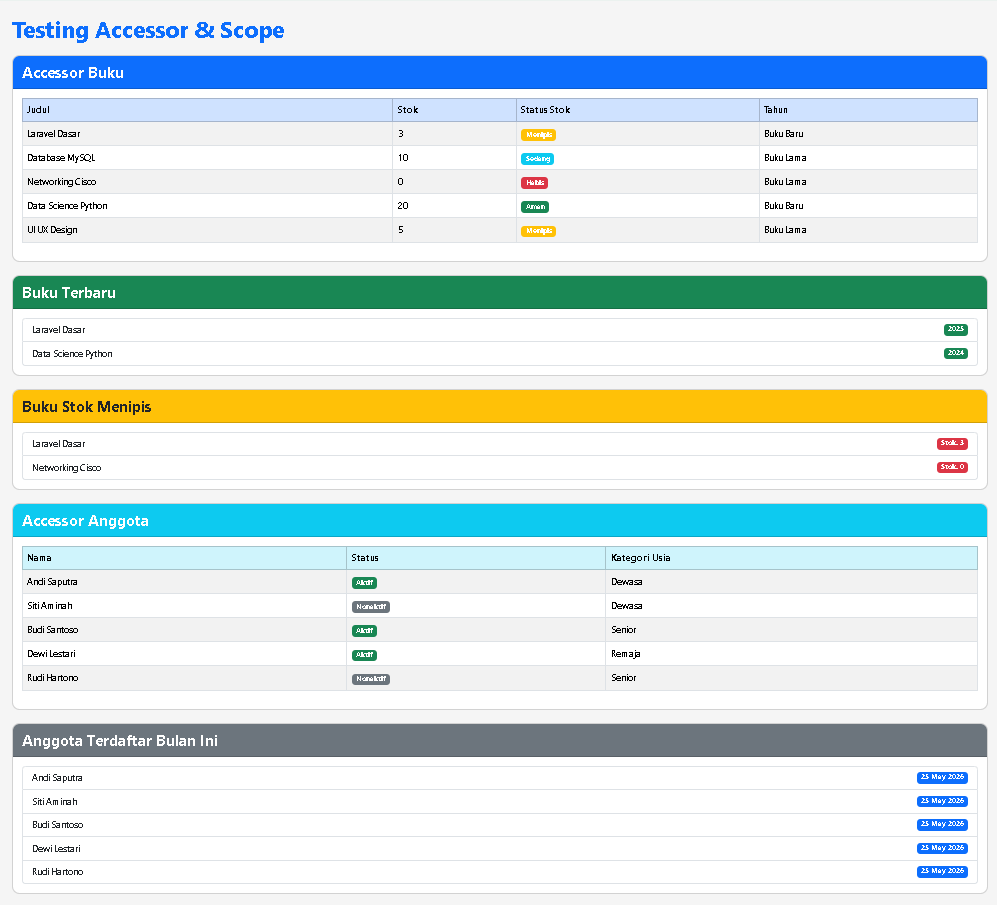

# 📚 Sistem Perpustakaan Laravel

Project Laravel sederhana untuk implementasi:
- Migration Database
- Seeder Database
- Accessor & Scope
- Testing Route Laravel

---


# 📌 Tugas 1 — Migration & Seeder Kategori

Pada tugas ini dibuat:
- Migration tabel `kategori`
- Model `Kategori`
- Seeder kategori buku

## Struktur Tabel Kategori


## Data Seeder


---

# 📌 Tugas 2 — Accessor & Scope

Pada tugas ini dibuat:
- Accessor pada Model Buku
- Scope pada Model Buku
- Accessor pada Model Anggota
- Scope pada Model Anggota
- Route testing accessor & scope

## Accessor Buku
- Status stok badge
- Tahun label

## Scope Buku
- stokMenipis()
- hargaRange()
- terbaru()

## Accessor Anggota
- statusBadge
- kategoriUsia

## Scope Anggota
- jenisKelamin()
- terdaftarBulanIni()

---

# 🧪 Route Testing

Route digunakan untuk menguji:
- Accessor Buku
- Scope Buku
- Accessor Anggota
- Scope Anggota

URL:

```text
http://127.0.0.1:8000/test-accessor-scope
```

## Hasil Route Testing


---
