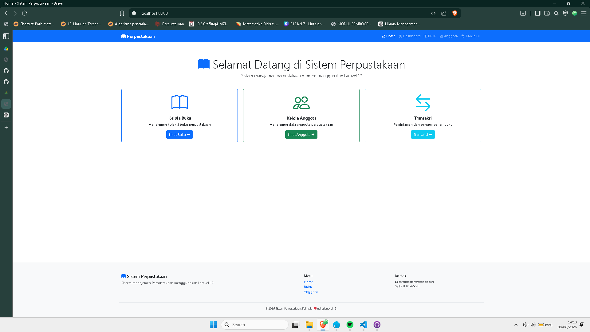
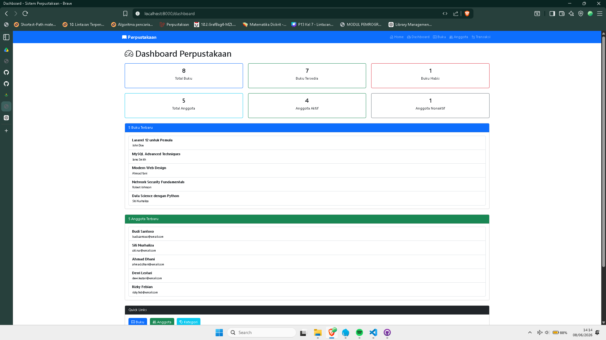
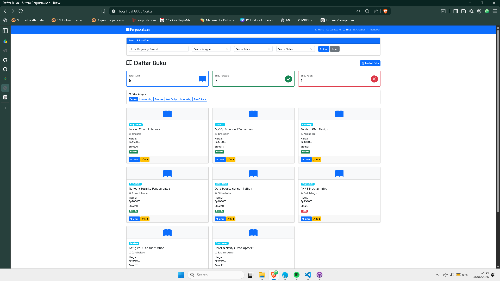
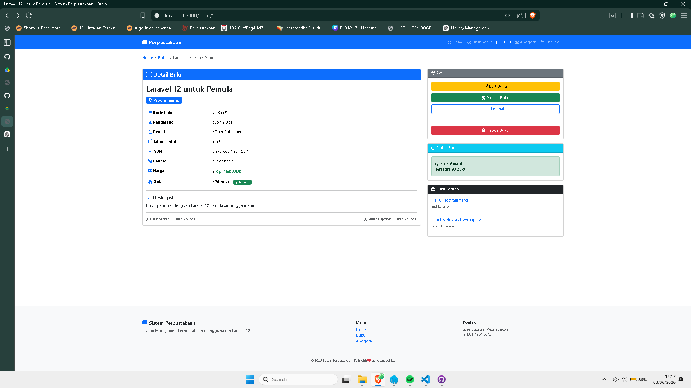
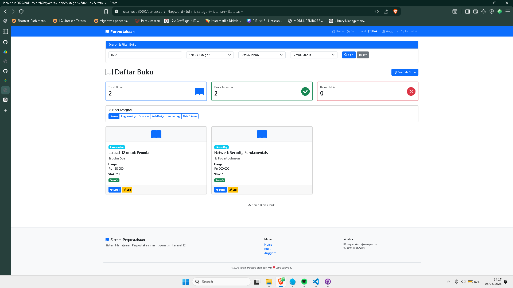
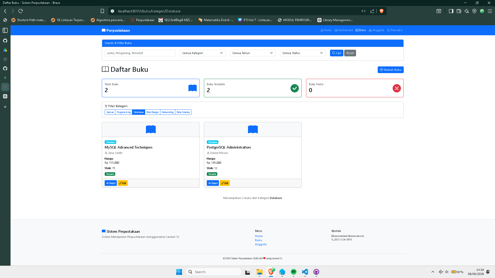
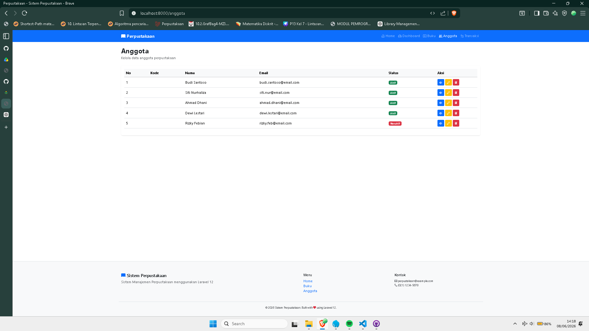

# 📚 Sistem Informasi Perpustakaan Laravel

Project ini merupakan aplikasi Sistem Informasi Perpustakaan berbasis Laravel yang digunakan untuk mengelola data buku dan anggota perpustakaan.

## Fitur

### Dashboard

* Total Buku, Buku Tersedia, Buku Habis
* Total Anggota, Anggota Aktif, Anggota Nonaktif
* 5 Buku Terbaru
* 5 Anggota Terbaru
* Quick Links Menu Utama

### Blade Component Buku Card

* Menampilkan informasi buku
* Judul, Pengarang, Harga, Stok
* Badge Kategori
* Status Ketersediaan
* Tombol Detail dan Edit

### Search & Filter Buku

* Pencarian berdasarkan Judul, Pengarang, dan Penerbit
* Filter Kategori
* Filter Tahun Terbit
* Filter Ketersediaan

## Screenshot

### Home

### Dashboard

### Buku

### Detail Buku

### Filter Search

### Filter Kategori

### Anggota

