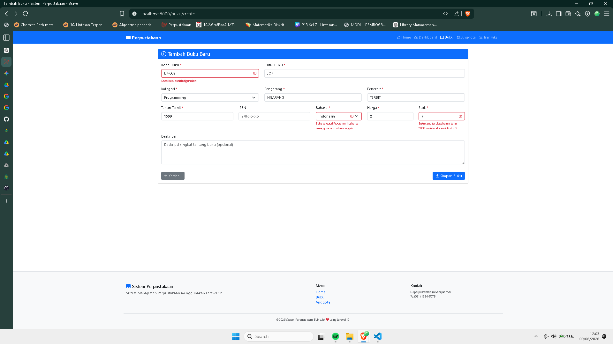
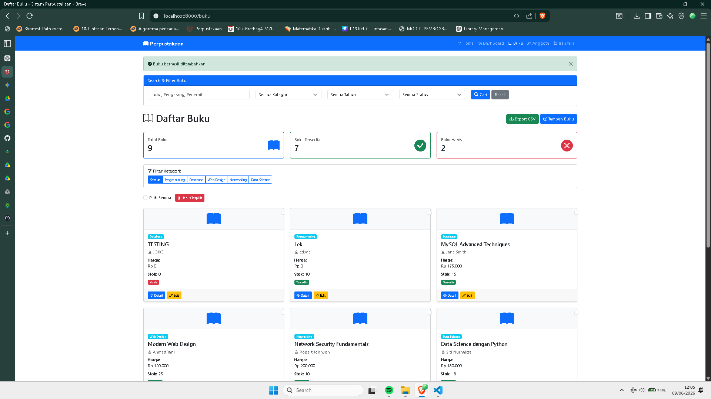
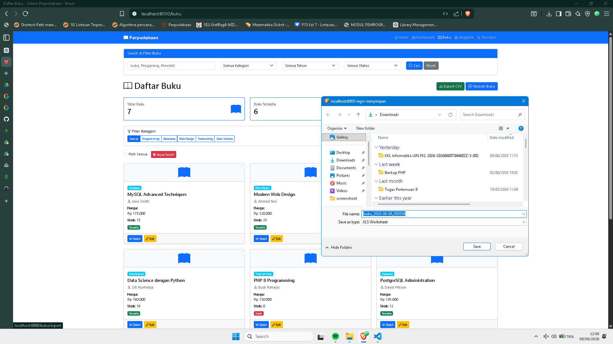

# 📚 Tugas Pertemuan 12 - Sistem Informasi Perpustakaan Laravel

Project ini merupakan pengembangan fitur lanjutan pada Sistem Informasi Perpustakaan berbasis Laravel.

## 🚀 Fitur yang Diimplementasikan

### 1. Advanced Validation

Menggunakan Form Request Validation dan Custom Validation Rule.

#### Validasi Kode Buku

Format kode buku harus mengikuti pola:

```text
BK-PROG-001
BK-DB-002
BK-NET-003
```

Contoh validasi:

- BK-PROG-001 ✅
- BK-DB-002 ✅
- PROG-001 ❌
- BK001 ❌

#### Conditional Validation

##### Kategori Programming

Jika kategori buku:

```text
Programming
```

maka bahasa wajib:

```text
Inggris
```

##### Buku Lama

Jika tahun terbit kurang dari:

```text
2000
```

maka stok maksimal:

```text
5
```

#### Custom Error Message Bahasa Indonesia

Contoh pesan validasi:

```text
Kode buku wajib diisi.
Format kode buku harus: BK-XXX-000.
Harga harus berupa angka.
Buku kategori Programming harus menggunakan bahasa Inggris.
```

---

### 2. Bulk Delete Buku

Fitur untuk menghapus beberapa data buku sekaligus.

#### Fitur

- Checkbox pada setiap buku
- Pilih Semua Buku
- Hapus Banyak Data Sekaligus
- Flash Message Berhasil

Contoh penggunaan:

```text
☑ Buku Laravel
☑ Buku PHP
☑ Buku MySQL

[ Hapus Terpilih ]
```

#### Hasil

```text
3 buku berhasil dihapus!
```

---

### 3. Export Data Buku ke CSV

Fitur export seluruh data buku ke format CSV.

#### Data yang Diexport

- Kode Buku
- Judul Buku
- Kategori
- Pengarang
- Penerbit
- Tahun Terbit
- ISBN
- Harga
- Stok

#### Hasil Export

File CSV otomatis terunduh:

```text
buku_2026-06-09_113000.csv
```

Contoh isi file:

```csv
Kode Buku,Judul,Kategori,Pengarang,Penerbit,Tahun,ISBN,Harga,Stok
BK-PROG-001,Laravel Dasar,Programming,Andi,Informatika,2024,12345,120000,10
```

---

## 📷 Screenshot

### Advanced Validation



### Bulk Delete Buku



### Export CSV



---

## 🛠️ Teknologi yang Digunakan

- Laravel 13
- PHP 8.3
- MySQL
- Bootstrap 5
- Bootstrap Icons

---

## 📖 Materi yang Dipelajari

- Custom Validation Rule
- Conditional Validation
- Form Request Validation
- Bulk Delete Data
- Export CSV
- Route Management
- Eloquent ORM
- Flash Message
- UI/UX Improvement

---

## 👨‍💻 Praktikum Framework Web

Tugas Pertemuan 12 - Laravel CRUD Lanjutan

Implementasi Advanced Validation, Bulk Delete Operations, dan Export Data CSV pada Sistem Informasi Perpustakaan.
