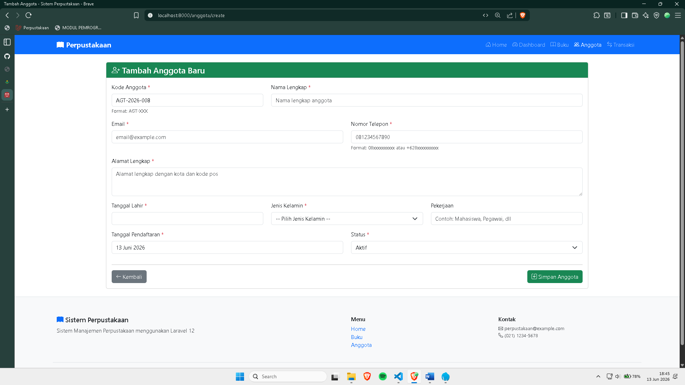
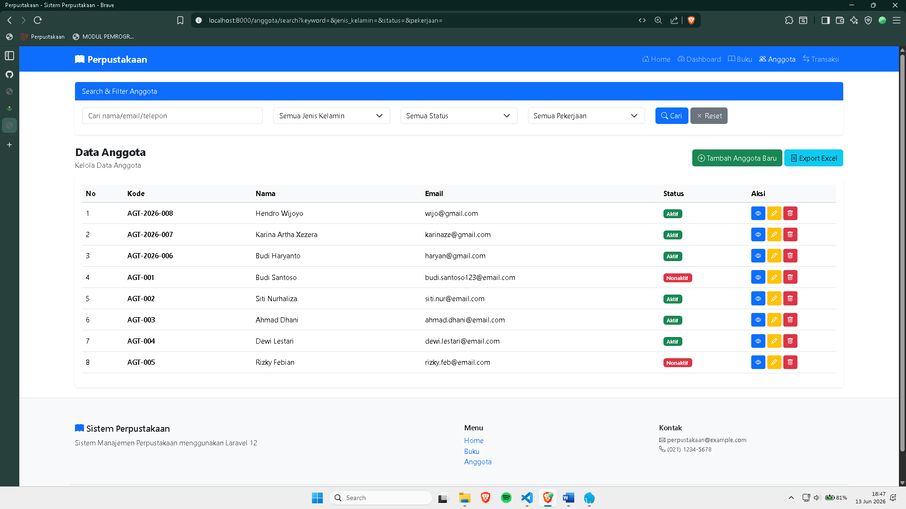
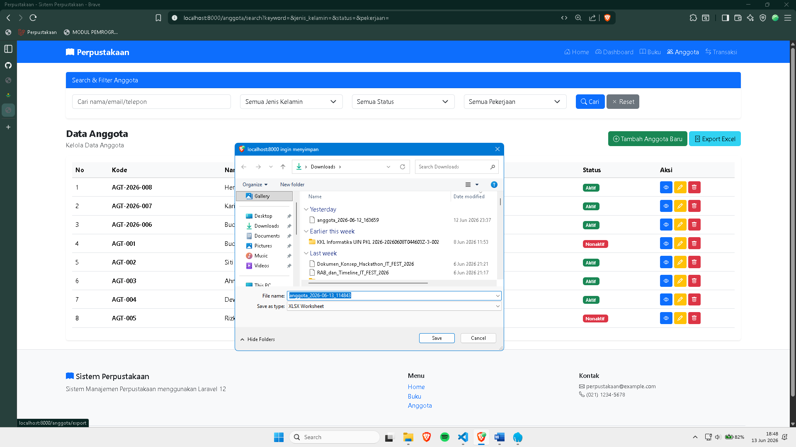
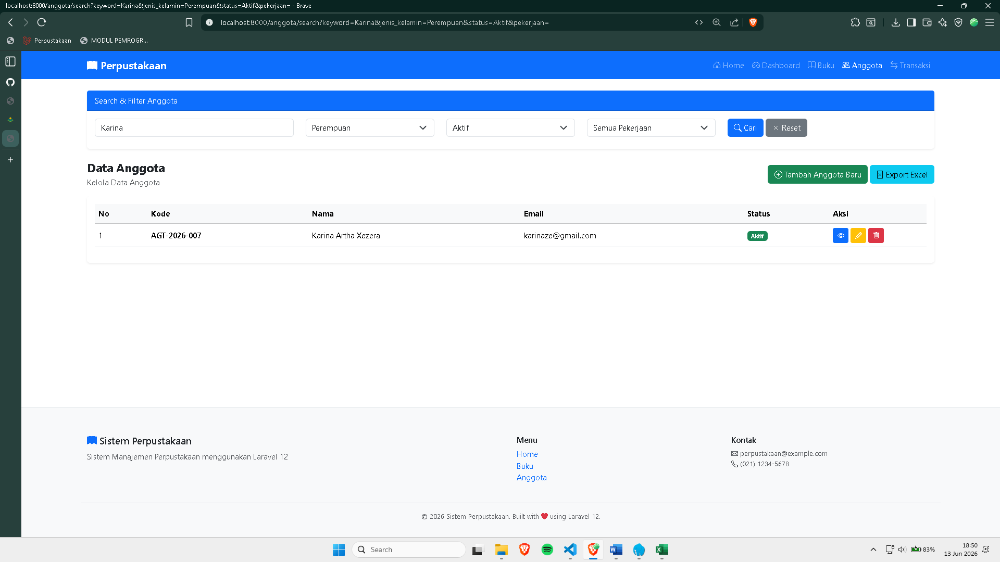
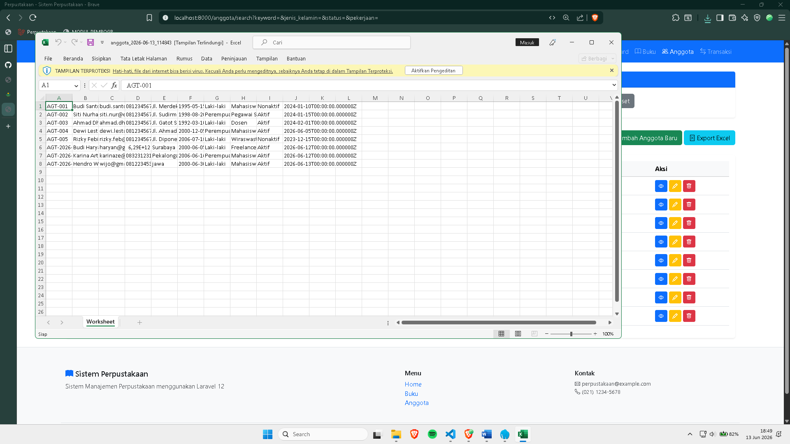

# 📚 Tugas Pertemuan 12 - Sistem Informasi Perpustakaan Laravel

Project ini merupakan pengembangan fitur lanjutan pada Sistem Informasi Perpustakaan berbasis Laravel.

## 📷 Screenshot

### 1. Auto Generate Kode Anggota

Implementasi auto-generate kode anggota dengan format: AGT-[TAHUN]-[NOMOR_URUT]

---

### 2. Export Anggota ke Excel

Implementasikan fitur export data anggota ke file Excel menggunakan package Laravel Excel (maatwebsite/excel) versi terbaru.

## 

### 3. Advanced Search & Filter

Tambahkan fitur search dan filter advanced untuk anggota.

---
