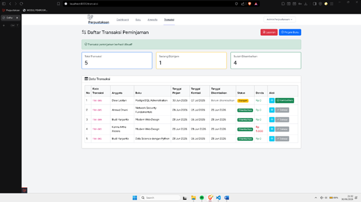
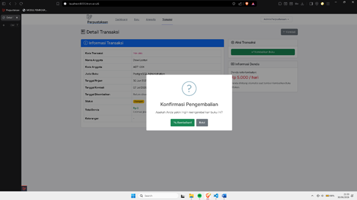
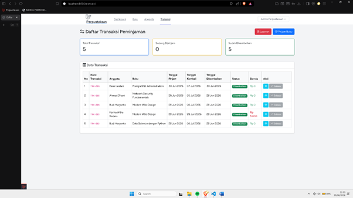
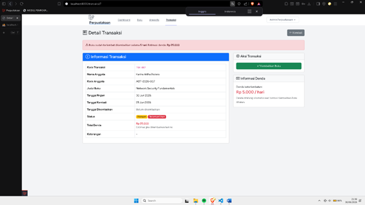
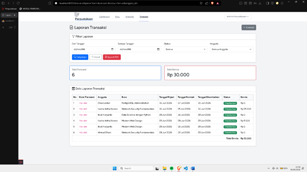
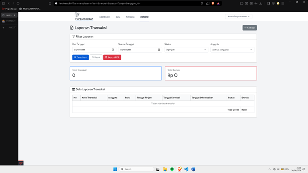
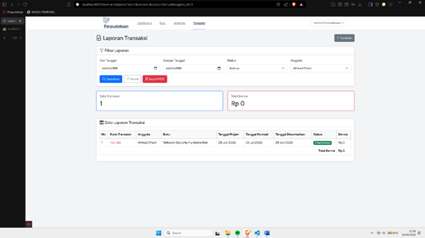
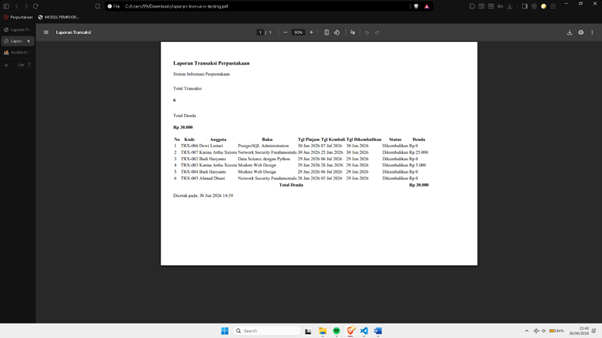
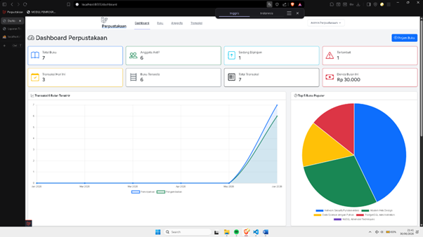

# Dokumentasi Tugas Praktikum Perpustakaan Laravel

Dokumentasi ini berisi hasil implementasi fitur:

1. Fitur Pengembalian Buku
2. Laporan Transaksi
3. Notifikasi Buku Terlambat

---

## 1. Fitur Pengembalian Buku

Fitur ini digunakan untuk mengembalikan buku yang sedang dipinjam. Saat buku dikembalikan, sistem akan menghitung denda jika terlambat dan stok buku bertambah 1.

### Screenshot Daftar Transaksi

Menampilkan transaksi dengan status **Dipinjam** dan tombol **Kembalikan**.

### Screenshot Detail Transaksi dan Konfirmasi Pengembalian

Menampilkan detail transaksi, status, tanggal kembali, total denda, dan tombol **Kembalikan Buku**.

Menampilkan popup konfirmasi sebelum buku dikembalikan.

### Screenshot Setelah Dikembalikan

Status transaksi berubah menjadi **Dikembalikan**, tanggal dikembalikan terisi, dan stok buku bertambah.

### Screenshot Denda Keterlambatan

Jika buku terlambat, sistem menampilkan denda Rp 5.000 per hari.

---

## 2. Laporan Transaksi

Fitur laporan digunakan untuk menampilkan data transaksi berdasarkan filter tanggal, status, dan anggota.

### Screenshot Halaman Laporan

Menampilkan tabel transaksi, total transaksi, total denda, filter, dan tombol export PDF.

### Screenshot Filter Status

Menampilkan data transaksi berdasarkan status **Dipinjam** yang ada dibawah.

### Screenshot Filter Anggota

Menampilkan transaksi berdasarkan anggota tertentu.

### Screenshot Export PDF

Menampilkan hasil laporan transaksi yang berhasil diexport ke PDF.

---

## 3. Notifikasi Terlambat

Fitur ini digunakan untuk menampilkan informasi transaksi yang sudah melewati tanggal kembali.

### Screenshot Dashboard Buku Terlambat

Menampilkan card **Buku Terlambat**, jumlah transaksi terlambat, dan list anggota terlambat.

## 

## Kesimpulan

Berdasarkan hasil pengujian, fitur pengembalian buku, laporan transaksi, export PDF, dan notifikasi keterlambatan berhasil diimplementasikan sesuai instruksi tugas.
